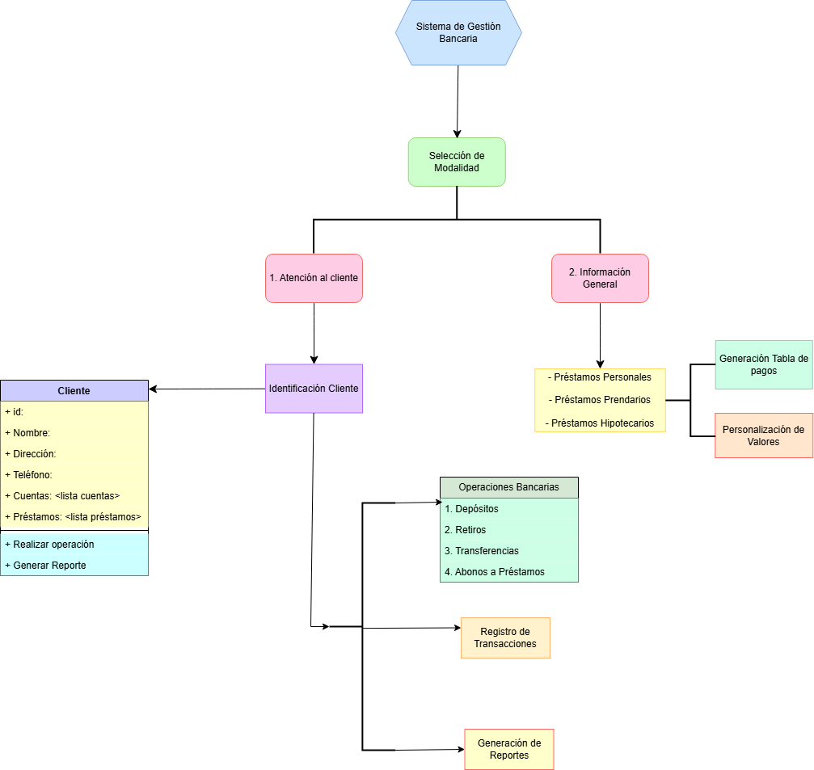
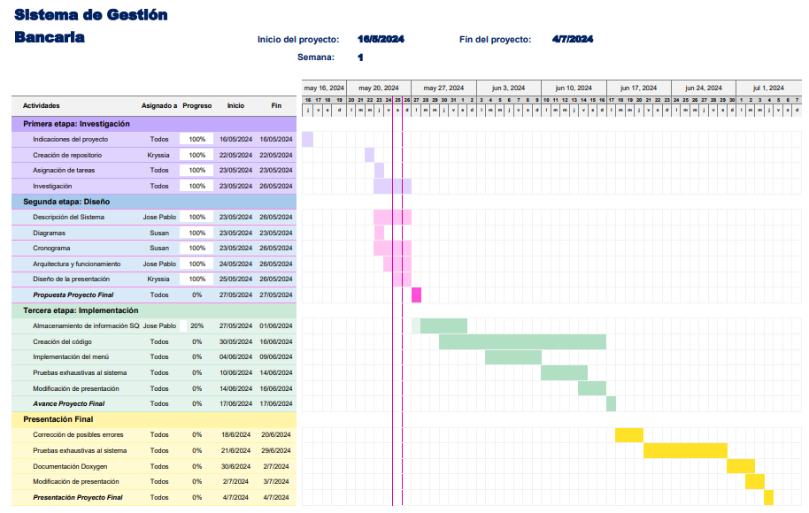

# ie0217-proyecto
Este repositorio es creado con el propósito de utilizarse como repo para desarrollar el proyecto final del curso de Estructuras Abstractas de Datos y Algoritmos para Ingeniería IE-0217.
## Grupo 2 estudiantes:
- Kryssia Martinez, carnet B84636.
- Jose Pablo Laurent, carnet B63761
- Susan Morales Alfaro, carnet A94203
## Tabla de Contenidos
1. [Descripción general del proyecto](#descripción)
2. [Instrucciones de Ejecución](#instrucciones)
3. [Notas](#notas)
4. [Primera parte del proyecto](#primera)
5. [Segunda parte del proyecto](#segunda)
6. [Estructura del Proyecto](#estructura)
7. [Prerrequisitos](#prerrequisitos)
8. [Instalación y Configuración](#instalación)
9. [Pruebas](#pruebas)
10. [Lecciones Aprendidas](#lecciones)
11. [Desafíos y Soluciones](#desafíos)
12. [Futuras Mejoras](#futuras)
13. [Conclusiones](#conclusiones)
14. [Documentacion](#documentación)
## 1. Descripción general del proyecto
 El proyecto tiene como objetivo desarrollar un sistema de gestión bancaria utilizado por agentes en ventanillas para atender a clientes en una entidad bancarias.

## 2. Instrucciones de Ejecución
Para compilar y ejecutar este proyecto, se deben seguir los siguientes pasos:
1. Clone el repositorio desde GitHub en su máquina local utilizando el siguiente comando:
```bash
git clone <URL_del_repositorio_del_proyecto>
```
- Reemplace <URL_del_repositorio_del_proyecto> por la url del repositorio de git.
2. Abra una terminal.
3. Navegue al directorio donde se encuentran los archivos, en este caso la estructura esta formada por una carpeta llamada ........
Ejemplo de como se la navegación hasta la carpeta: (REEMPLAZAR)
```
PS C:\Users\Dell\Desktop\ie0217> cd Tareas
PS C:\Users\Dell\Desktop\ie0217\Tareas> cd Tarea5
PS C:\Users\Dell\Desktop\ie0217\Tareas\Tarea5> cd src
PS C:\Users\Dell\Desktop\ie0217\Tareas\Tarea5\src> mingw32-make
>>
```
4. Ejecute el siguiente comando para compilar el programa y generar el ejecutable que a su vez inicia el programa con el menu de entrada del proyecto:
```bash
mingw32-make
```
De esa manera se genera un archivo ejecutable.
Ejemplo de como se ve el uso del comando: (REEMPLAZAR)
```
PS C:\Users\Dell\Desktop\ie0217\Tareas\Tarea5\src> mingw32-make
>>
```
4. Una vez compilado correctamente, se ve de la siguiente forma: (REEMPLAZAR)
```bash
g++ -std=c++11 -Wall -c main.cpp -o main.o
g++ -std=c++11 -Wall -c ValidadorEmail.cpp -o ValidadorEmail.o
g++ -std=c++11 -Wall -o tarea5.x main.o ValidadorEmail.o
./tarea5.x
```
7. Siga las instrucciones en pantalla para interactuar con el programa.
Ejemplo de salida del menú:
```bash
```
## 3. Notas
- Este proyecto lleva los comentarios necesarios para dar a entender lo que se realizó durante su desarrollo y al final se encuentra la documentación creada de manera adecuada.


## 4. Primera parte del proyecto
## Parte Teórica
### Sistema de gestión bancaria
- **Qué es un sistema de gestión bancaria:**
    - La gestión bancaria se encarga de controlar y rastrear el flujo de dinero de una entidad, de esa manera se pueden tomar las medidas necesarias para que una compañía sea más rentable y segura económicamente.

    - En este caso, el sistema de gestión bancaria a realizar en este proyecto se trata de un sistema que va a utilizarse para gestionar ingresos, gastos y activos de las personas que lo utilicen, así como informar a las personas sobre los tipos de préstamos y todo lo necesario acerca de las cuentas bancarias. Esto mediante el menú de entrada interactivo, con las diferentes opciones para que una persona pueda obtener información y gestionar algún cambio en sus cuentas.

- **Funcionalidades:**
    - Sobre gestión de cuentas: En este caso, para este sistema un cliente puede tener hasta 2 cuentas bancarias, una en colones y otra en dólares, en las cuales puede gestionar sus ahorros o los certificados de depósito a corto plazo.
    - Transacciones: Referente a las transacciones, se puede acceder a la parte de registro, desde el menú, inicialmente una persona puede interactuar con las opciones disponibles para adquirir información o bien registrarse, ver los tipos de préstamo e incluso obtener la tabla de valores con las cuotas y tasas de interés.
    - Préstamos: Referente a esta etapa, se trabajará con préstamos personales, prendarios e hipotecarios en los cuales una persona puede adquirir uno, abonarlo o incluso abonar el de otras personas.
- **Normativa:**
    - Regulaciones bancarias aplicables: Esta parte es importante, en un banco normalmente se tiene un sistema que regula cuidadosamente las transacciones que realizan las personas, así como la confidencialidad la protección de datos, se previene el lavado de dinero y se intenta cumplir las normas del banco y otros organismos reguladores, para obtener un préstamo usualmente se hace un estudio, en el cual es necesario cumplir con ciertos requisitos y presentar documentos que respalden esos requisitos, después se revisan y se procede a hacer un estudio para rechazar o aprobar.
    - Cumplimiento de la normativa y seguridad: Luego, por esta parte el banco asegura la seguridad a sus clientes, con un sistema robusto que mantiene la integridad y confidencialidad de los datos de los clientes. Aquí se incluye el uso de protocolos de seguridad para la transmisión de datos y el almacenamiento seguro de información sensible de cada persona.

    - En este sistema: En el caso de este sistema, se intentará realizar un sistema seguro con manejo de excepciones, para el correcto funcionamiento y a los clientes se le asignará un numero de identificación único.
### Modalidad de operación:
- **Información general:**
    - Muestra opciones de préstamos personales, prendarios e hipotecarios, de manera adicional genera una tabla de pagos de acuerdo a la información elegida.
- **Atención al cliente:**
    - Procesos y operaciones realizadas en la atención directa a clientes.
<!-- **información general sobre los préstamos:**
    - información que se proporciona:
    - Herramientas y cálculos utilizados para mostrar opciones de préstamos.-->
### Tipos de préstamos:
- **Préstamos personales:**
    Este tipo de préstamo permite pedir dinero prestado a una institución financiera sin necesidad de tener como respaldo un bien en específico. Usualmente su tasa de interés suele ser más alta que las de otros tipos de préstamos debido a que no cuenta con el respaldo de un determinado bien. Según, el Banco de Costa Rica (BCR) las tasas de interés anual es alrededor de **15% - 20%**.
- **Préstamos prendarios:**
    Este tipo de préstamo consiste en prestar dinero, donde el préstamo se encuentra respaldado por un bien tangible. En caso de no poder pagar el préstamo, la institución financiera se quedará con el bien tangible. En Costa Rica, la tasa de interés anual para préstamos prendarios (préstamos con garantía) puede variar dependiendo de la institución financiera y las condiciones del mercado. Actualmente, los préstamos con garantía tienen tasas de interés entre el **12% y el 16%** anual​.
- **Préstamos hipotecarios:**
    El préstamo hipotecario consiste en prestar una determinada cantidad de dinero para la compra de una propiedad, si el prestatario no cumple con el pago el prestamista tiene derecho a tomar la propiedad. Las tasas de interés para préstamos hipotecarios en el Banco de Costa Rica (BCR) pueden estar alrededor del **8%** a **9%** anual.
- **Calculo de tablas de pagos:**
    - Fórmulas y métodos para calcular cuotas mensuales y tablas de interés: En este caso se puede utilizar una fórmula de amortización, la fórmula de interés compuesto para calcular las cuotas mensuales de los préstamos, para imprimir la tabla de pagos esperados. 

    - **Tasa de interés mensual:**


         

         - r, es la tasa de interés mensual y r_a es la tasa de interés anual.

    - **Cuota mensual:** 


         ^{n}}{(1&plus;r)^{n}-1})


         - P es el monto del préstamo, r es la tasa de interés mensual y n es el número total de cuotas.
- **Valores personalizados:**
    - Cálculo de tablas con valores personalizados de monto, cuotas, y tasa de interés: En esta opción se hace uso de la misma fórmula, pero el usuario tiene la opción de obtener la tabla mediante valores personalizados puede ingresar el monto, la cantidad de cuotas y la tasa de interés, de esa manera se imprime la información esperada.

### Cuentas bancarias:
- **Tipos de cuentas:**
    - Cuenta en colones: El cliente tiene la opción de tener una cuenta bancaria para gestionar sus ahorros.
    - Cuenta en dólares: De manera análoga, el cliente tiene la opción de tener una cuenta bancaria para gestionar sus ahorros.
    - Certificados de depósito a plazo (CDP): El cliente tiene la opción de depositar una cantidad de dinero, en un periodo de tiempo fijo, a cambio de una tasa de interés más alta que una cuenta de ahorros, donde el dinero depositado no se podrá retirar antes de periodo de tiempo establecido sin incurrir en penalizaciones.
### Operaciones:
- **Depósitos:**
    El cliente podrá depositar dinero dentro de sus cuentas bancarias, ya sea en colones o en dólares.
    <!--El cliente podrá realizar depósitos a su préstamos, donde estos podrán ser una fracción del préstamos total aunado a la tasa de interés o se podrá pagar la totalidad del préstamos aunado a la tasa de interés..-->
- **Retiros:**
    El cliente podrá realizar retiros de su cuenta en colones o de sus cuentas en dólares, este retiro debe ser una fracción o la totalidad del dinero contenido en la cuenta bancaria seleccionada.
- **Transferencias:**
    El cliente podrá realizar transferencias entre cuentas bancarias, donde los clientes receptores deben de existir y el monto no debe superar la totalidad del monto almacenado dentro de la cuenta del emisor.
- **Abonos a préstamos:**
    El cliente podrá realizar abonos a sus préstamos, donde estos podrán ser una fracción del préstamos total aunado a la tasa de interés o se podrá pagar la totalidad del préstamos aunado a la tasa de interés.
### Registro de las transacciones
- **Métodos disponibles:**
    Las transacciones serán almacenadas en una base de datos SQL, que almacenará un número de identificación del cliente, tipo de transacción efectuada, monto de la transacción efectuada y fecha a la que se efectuó la transacción.
### Seguridad
- **Método de identificación de los clientes:**
    Los clientes serán almacenados dentro de una base de datos SQl, que contendrá las columnas de un número de identificación único para cada cliente entre 0 y 999999999, saldo de la cuenta en colones, saldo de la cuenta en dólares, tipo de préstamo, saldo del tipo de préstamo y fecha a la que se creó el usuario del cliente.
### Préstamos asociados y Reportes:
- **Estructura de los Préstamos:**
    - Características específicas como tasa de interés, período y cuota mensual:
        - Cada préstamo tendrá un registro que incluirá el monto principal, la tasa de interés, el plazo del préstamo (en meses), la cuota mensual, y la fecha de inicio.
- **Generación de reportes:**
    - Reportes detallados en formato tabular:
        - El sistema va a generar un archivo de texto con un reporte que incluye las cuotas pagadas hasta la fecha, incluyendo un desglose del monto destinado a capital y los intereses abonados hasta el momento.


   
## 5. Segunda parte del proyecto
## Etapa de diseño
### **Descripción del Diagrama**

#### 1. **Inicio:** 
 El sistema se inicia y presenta dos opciones principales: "Atención a Clientes" e "Información General sobre Préstamos". 

#### 2. **Selección de Modalidad:** 

 - Si se selecciona "Atención a Clientes", el flujo pasa a la interacción con los clientes. 

 - Si se selecciona "Información General sobre Préstamos", el flujo permite al usuario consultar información de préstamos y generar tablas de pagos. 

#### 3. **Interacción con Clientes:**

 - **Identificación del Cliente:** El agente ingresa el número de identificación del cliente. 

 - **Verificación de la Identidad:** El sistema verifica la identidad del cliente. 

 - **Operaciones Bancarias:** El cliente puede realizar operaciones como depósitos, retiros, transferencias y abonos a préstamos. 

 - **Registro de Transacciones:** Cada transacción se registra en la base de datos. 

 - **Generación de Reportes:** El cliente puede solicitar un reporte de sus préstamos. 

#### 4. **Información General sobre Préstamos:**

 - **Consulta de Tipos de Préstamos:** El usuario selecciona entre préstamos personales, prendarios e hipotecarios. 

 - **Generación de Tabla de Pagos:** El sistema genera una tabla de pagos esperados según el monto ingresado. 

 - **Personalización de Valores:** El usuario puede ingresar valores personalizados para monto, cuotas y tasa de interés. 

#### 5. **Fin:** 
 El flujo termina y el sistema puede cerrar la sesión o reiniciar para otra operación. 

#### **Diagrama**
 A continuación se muestra el diagrama que representa el sistema de gestión bancaria, que refleja los procesos clave desde la interacción inicial hasta la realización de las operaciones bancarias y la generación de informes.



### **Cronograma**
 Se planifica un cronograma detallado de actividades, asignando responsabilidades específicas a cada integrante del proyecto.



## 6. Estructura del Proyecto
- Este proyecto se encuentra segmentado de la siguiente manera:

IE0217-PROYECTO/

├── databases/  
│  └── banco.db  
├── src/   
│   ├── main.cpp  
│   ├── clientDb.cpp  
│   ├── Funciones.cpp  
│   ├── prestamosDb.cpp  
│   ├── transactionDb.cpp  
│   ├── CertificadoDepositoPlazo.cpp  
│   ├── clientDb.hpp  
│   ├── Funciones.hpp  
│   ├── prestamosDb.hpp  
│   ├── transactionDb.hpp  
│   └── CertificadoDepositoPlazo.hpp  
├── readme.md  
├── Cronograma1.PNG  
└── gestionBancaria.png

- Cada uno de los archivos agregados son una parte importante para el correcto funcionamiento del sistema de gestion bancaria y fueron agregados para cumplir con las peticiones y requerimientos del enunciado del proyecto final.

- Acontinuación encontrará una descripcion de cada uno de los archivos y los puntos importantes.


La documentación de este proyecto ha sido generada utilizando Doxygen. (AGREGAR MAS COSAS)


### Acceder a la Documentación en Formato HTML


Se puede acceder a la documentación en formato HTML siguiendo este enlace:
[Documentación HTML](REEMPLAZAR)

